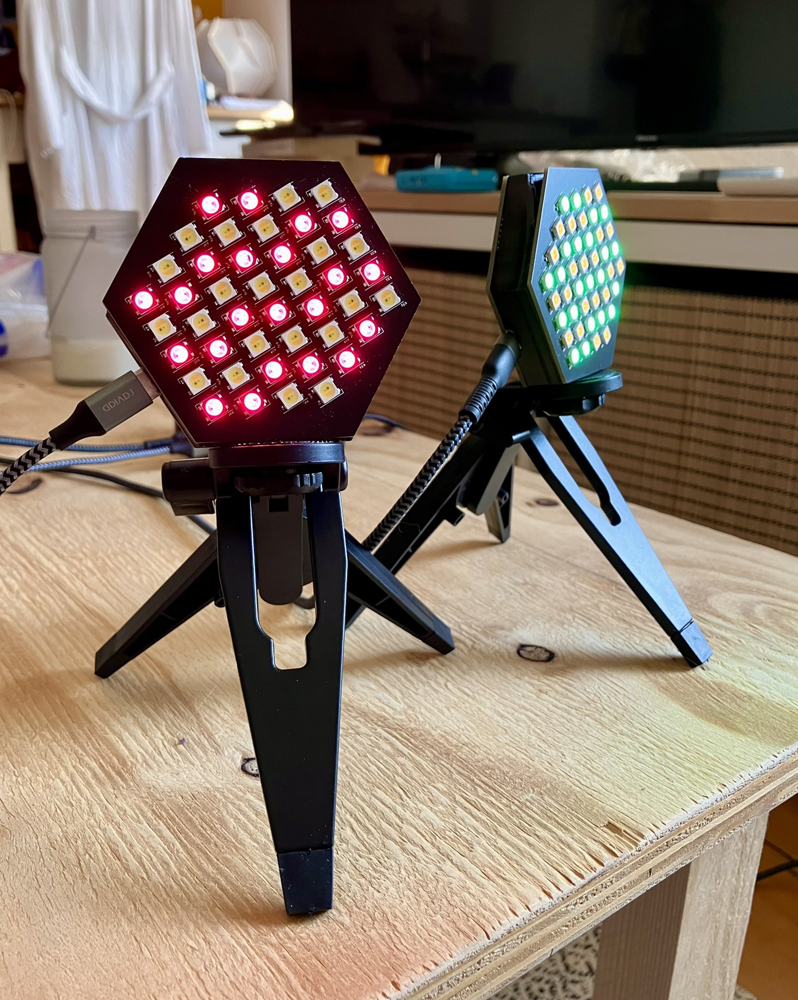
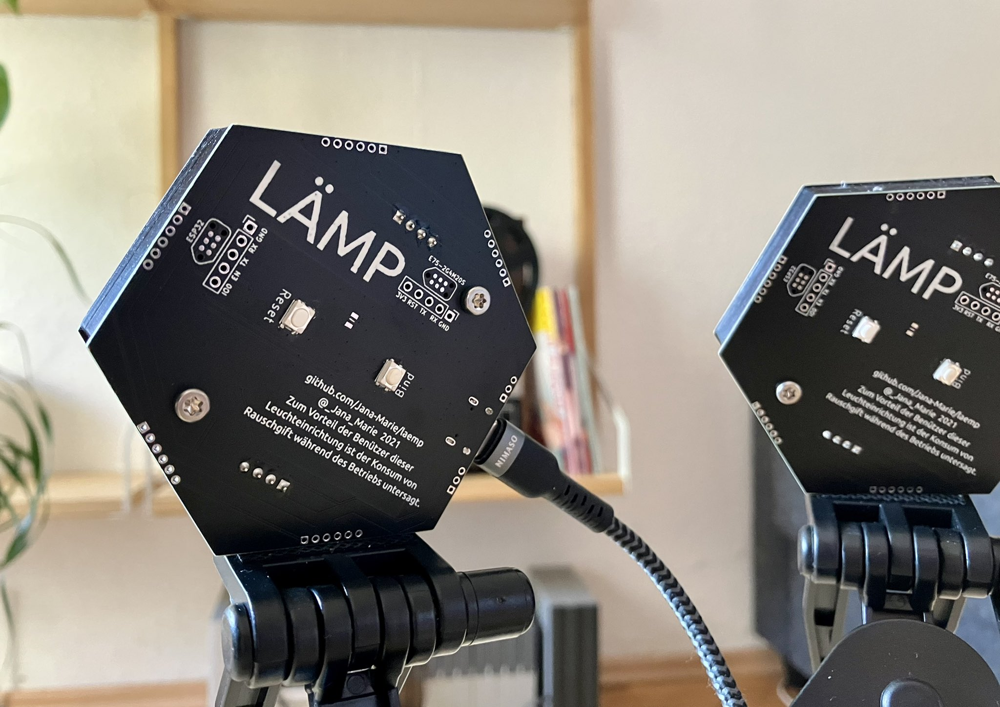

# LAEMP-Panel

LAEMP-Panel is a Zigbee controllable (e.g. philips hue) RGBY + W spot, which can be soldered at home and is easy to assemble. The extra yellow channel gives a much wider dynamic. This is archived by alternating CW/WW/A (Cold-, Warm-White, Amber) and RGB LEDs. LAEMP-Panel can be mounted on mini-tripods and is powered via 5V USB Type-C. A ZigBee bridge (e.g. Philips Hue) is needed for control.

<table>
  <tbody>
    <tr>
      <td>
        
      </td>
      <td>
        
      </td>
    </tr>
  </tbody>
</table>

### Sister project

LAEMP-Panel is a sister project to [LAEMP-Prism](https://github.com/Jana-Marie/LAEMP-Prism)

## Firmware

There are two firmwares to be flashed, one for the ESP32 and one for the E75-2G4M20S.

### ESP32

This is a simple Arduino project and can be flashed via Arduino (initially built on Arduino 1.8.19).

### E75

Please refer to the awesome works of [PeeVeeOne](https://peeveeone.com/zll-tldr/) to flash `Light_ColorLight_JN5168_RGB` onto the E75-2G4M20S module.

## Todo

 - [ ] Profile CRI
   - [ ] Increase CRI by selectively adding colors to WW/CW (i.e. green)
 - [ ] Update Baseboard to v2

## License

Copyright Jana Marie Hemsing 2023.
This source describes Open Hardware and is licensed under the CERN-
OHL-S v2.

You may redistribute and modify this source and make products using it
under the terms of the CERN-OHL-S v2
([LICENSE](/LICENSE)).

This source is distributed WITHOUT ANY EXPRESS OR IMPLIED
WARRANTY, INCLUDING OF MERCHANTABILITY, SATISFACTORY
QUALITY AND FITNESS FOR A PARTICULAR PURPOSE. Please see
the CERN-OHL-S v2 for applicable conditions.

Source location: https://github.com/Jana-Marie/LAEMP-Panel/
As per CERN-OHL-S v2 section 4, should You produce hardware based
on this source, You must where practicable maintain the Source Location
visible on the external case of LAEMP-Panel or other products you make using
this source
